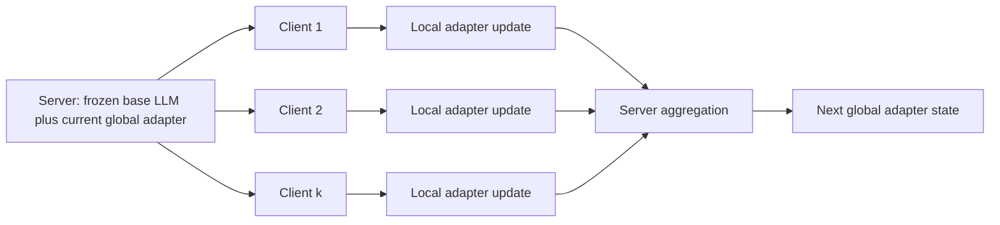
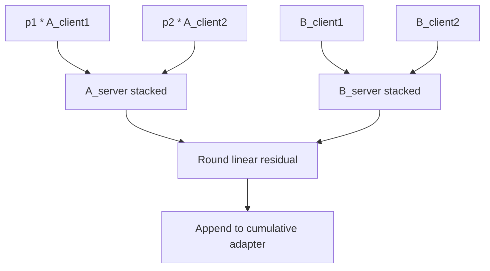
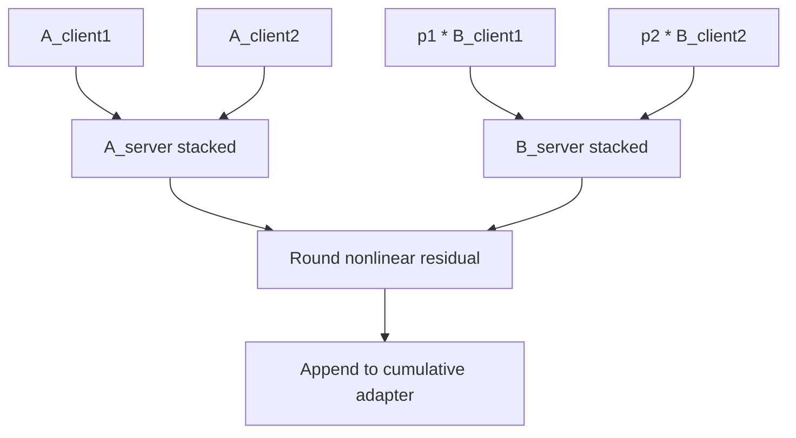
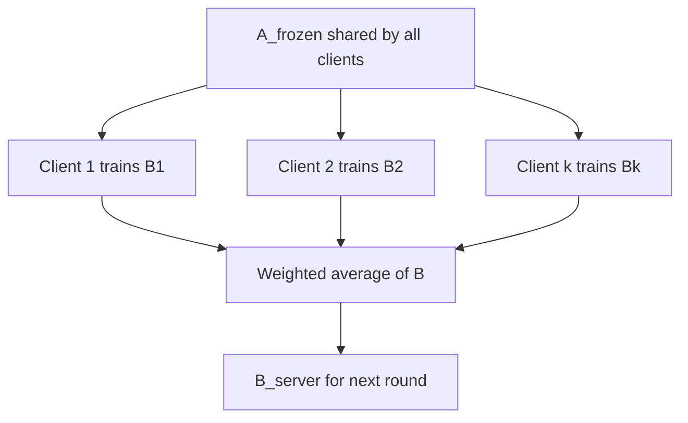

# V-FLoRA Methods

V-FLoRA is organized around one question:

> Which LoRA-style adaptation and federated training strategy gives the best tradeoff between accuracy, communication, client heterogeneity, and local training cost?

The experiments compare three axes:

- **Adapter variant:** linear cumulative FLoRA, nonlinear cumulative FLoRA, nonlinear FFA, and future LayerCraft adapter variants.
- **Data strategy:** non-IID Dirichlet splits versus stratified client-preserving splits.
- **Training schedule:** local epoch count versus communication-round budget.

## Shared Federated Round

Each method follows the same federated pattern:



Only adapter parameters are trained or aggregated. The base model remains frozen.

## Linear Cumulative FLoRA

CLI method name:

```text
linear-cumulative-flora
```

Per client and round:

```text
y = W0 x + s_frozen * B_frozen(A_frozen x) + s_new * B_new(A_new x)
```

After server aggregation, the new round adapter is appended to the cumulative adapter:

```text
y = W0 x + sum_t s_t * B_t(A_t x)
```

For one round, client-size weights are applied to `A`, while `B` is concatenated:

```text
A_server = concat(p1 A1, p2 A2, ..., pk Ak)
B_server = concat(B1, B2, ..., Bk) along the rank dimension
```



## Nonlinear Cumulative FLoRA

CLI method name:

```text
nonlinear-cumulative-flora
```

Per client and round:

```text
y = W0 x + s_frozen * B_frozen(gelu(A_frozen x)) + s_new * B_new(gelu(A_new x))
```

After server aggregation:

```text
y = W0 x + sum_t s_t * B_t(gelu(A_t x))
```

For one round, `A` is concatenated without weighting and client-size weights are applied to `B`:

```text
A_server = concat(A1, A2, ..., Ak)
B_server = concat(p1 B1, p2 B2, ..., pk Bk) along the rank dimension
```

This matters because weighting `A` would place the client weight inside `gelu(.)`, changing the nonlinear function instead of only weighting the client contribution.



## Nonlinear FFA

Planned CLI method name:

```text
nonlinear-ffa
```

FFA freezes the `A` matrix and trains only `B`:

```text
y = W0 x + s * B(gelu(A_frozen x))
```

Server aggregation averages only `B`:

```text
B_server = sum_i p_i B_i
```



## LayerCraft Adapter Variants

LayerCraft is not required for the current direct implementations of `linear-cumulative-flora` and `nonlinear-cumulative-flora`.

It is the intended optional backend for broader adapter-variant experiments such as:

- `lora_nonlinear`
- `baba`
- `shim`
- diagonal/full/orthogonal transformation adapters
- layer-wise mixed adapter configurations

Install it only when running LayerCraft-backed experiments:

```bash
pip install git+https://github.com/trantrieuvy/layercraft.git
```

## Dataset Strategy

V-FLoRA does not commit the generated WizardLM or Dolly splits. Instead, it provides split-generation helpers so experiments can be reproduced:

- Dirichlet client partitioning for non-IID baselines.
- Stratified client-preserving splits for controlled comparisons.
- WizardLM stratification by heuristic task family and instruction-length bucket.

## Epoch/Round Tuning

Epoch/round tuning is planned around manifest files. The intended workflow is:

```text
manifest -> launch runs -> parse scores/logs -> select efficient schedules
```

The manifest format will be added once the active tuning manifests are available.

