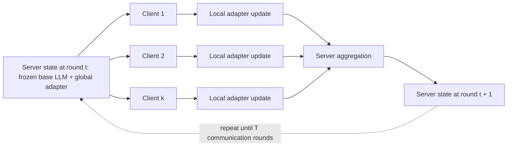
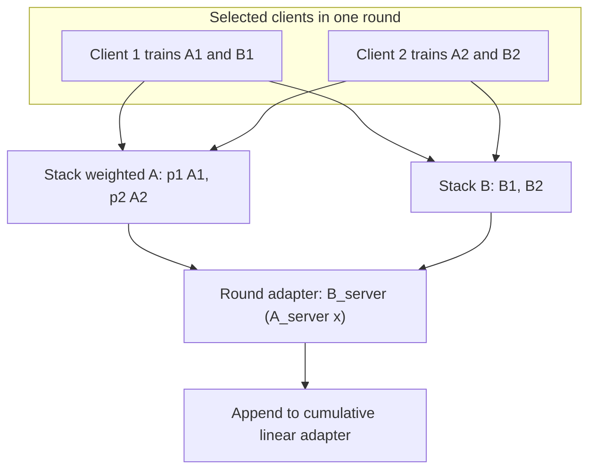
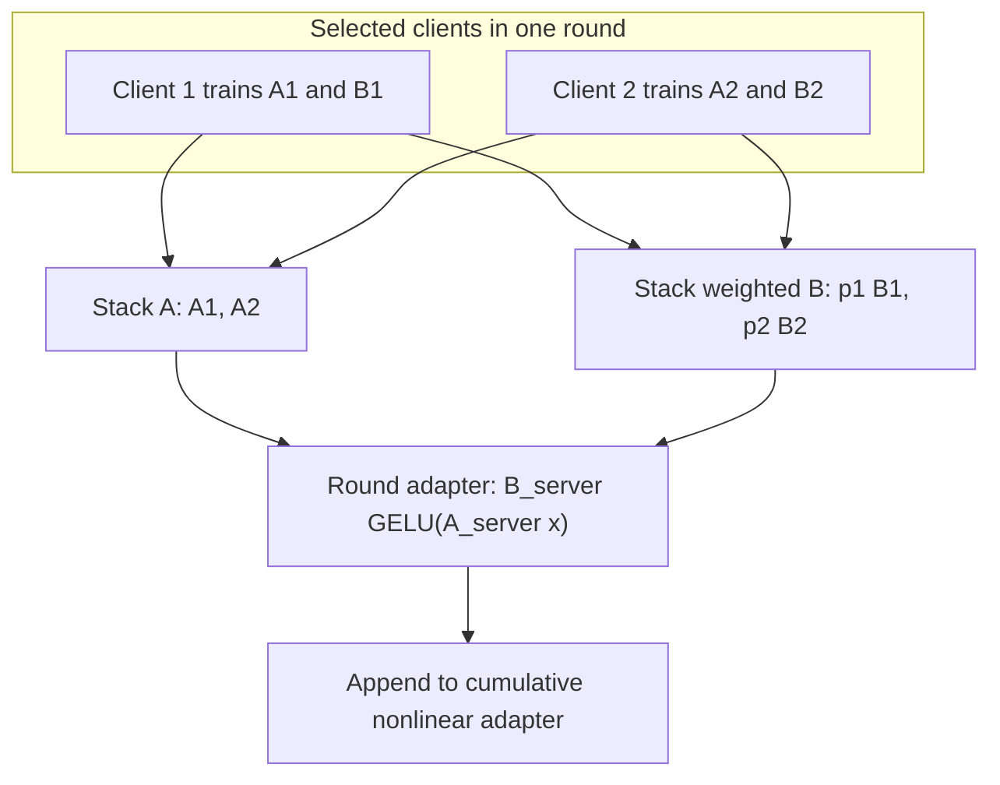
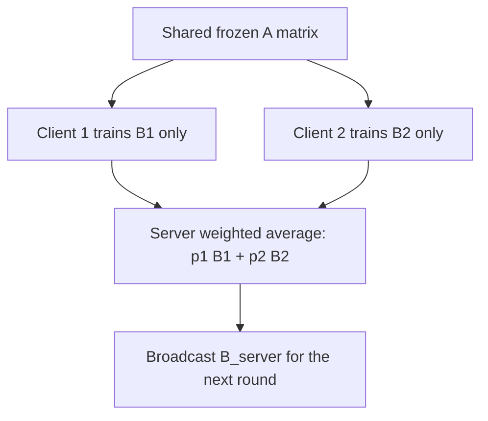

# V-FLoRA Methods

V-FLoRA is organized around one question:

> Which LoRA-style adaptation and federated training strategy gives the best tradeoff between accuracy, communication, client heterogeneity, and local training cost?

The experiments compare three axes:

- **Adapter variant:** linear cumulative FLoRA, nonlinear cumulative FLoRA, nonlinear FFA, and future LayerCraft adapter variants.
- **Data strategy:** non-IID Dirichlet splits versus stratified client-preserving splits.
- **Training schedule:** local epoch count versus communication-round budget.

## Shared Federated Round

Each method follows the same federated pattern for communication rounds `t = 1, ..., T`:



Only adapter parameters are trained or aggregated. The base model remains frozen.

## Linear Cumulative FLoRA

CLI method name:

```text
linear-cumulative-flora
```

Per client `i` in communication round `t`, the trainable residual is linear:

$$
h_i^{(t)}(x) = B_i^{(t)} A_i^{(t)} x
$$

The model used by the client is:

$$
y = W_0 x + s \sum_{r < t} B^{(r)} A^{(r)} x + s B_i^{(t)} A_i^{(t)} x
$$

For one server aggregation step with client weights `p_i`, V-FLoRA stacks the client adapters as:

$$
A^{(t)} = \mathrm{concat}(p_1 A_1^{(t)}, p_2 A_2^{(t)}, \ldots, p_k A_k^{(t)})
$$

$$
B^{(t)} = \mathrm{concat}(B_1^{(t)}, B_2^{(t)}, \ldots, B_k^{(t)})
$$

Weighting `A` or `B` is equivalent for the linear case because the client contribution is bilinear. The implementation weights `A` and leaves `B` unweighted.



After `T` communication rounds, the cumulative adapter is:

$$
y = W_0 x + s \sum_{t=1}^{T} B^{(t)} A^{(t)} x
$$

## Nonlinear Cumulative FLoRA

CLI method name:

```text
nonlinear-cumulative-flora
```

Per client `i` in communication round `t`, the trainable residual inserts a nonlinear activation between the two low-rank factors:

$$
h_i^{(t)}(x) = B_i^{(t)} \sigma(A_i^{(t)} x), \quad \sigma = \mathrm{GELU}
$$

The model used by the client is:

$$
y = W_0 x + s \sum_{r < t} B^{(r)} \sigma(A^{(r)} x) + s B_i^{(t)} \sigma(A_i^{(t)} x)
$$

For one server aggregation step with client weights `p_i`, V-FLoRA stacks the client adapters as:

$$
A^{(t)} = \mathrm{concat}(A_1^{(t)}, A_2^{(t)}, \ldots, A_k^{(t)})
$$

$$
B^{(t)} = \mathrm{concat}(p_1 B_1^{(t)}, p_2 B_2^{(t)}, \ldots, p_k B_k^{(t)})
$$

The client weights are applied to `B`, not `A`, because weighting `A` would place `p_i` inside `GELU(.)` and change the nonlinear function.



After `T` communication rounds, the cumulative adapter is:

$$
y = W_0 x + s \sum_{t=1}^{T} B^{(t)} \sigma(A^{(t)} x)
$$

## Nonlinear FFA

CLI method name:

```text
nonlinear-ffa
```

FFA freezes the `A` matrix and trains only `B`:

$$
y = W_0 x + s B \sigma(A_{\mathrm{frozen}} x), \quad \sigma = \mathrm{GELU}
$$

For one server aggregation step, only `B` is averaged:

$$
B^{(t)} = \sum_{i=1}^{k} p_i B_i^{(t)}
$$

The implementation initializes `A` once from the run seed and writes it to
`A_frozen.bin`. Homogeneous runs use the configured rank. Heterogeneous runs use
`max(local_ranks)` as the global FFA rank and give each client a prefix slice of
that shared `A` and `B`.



## LayerCraft Adapter Variants

LayerCraft is not required for the current direct implementations of `linear-cumulative-flora`, `nonlinear-cumulative-flora`, and `nonlinear-ffa`.

It is the intended optional backend for broader adapter-variant experiments such as:

- `lora_nonlinear`
- `baba`
- `shim`
- diagonal/full/orthogonal transformation adapters
- layer-wise mixed adapter configurations

Install it only when running LayerCraft-backed experiments:

```bash
pip install git+https://github.com/trantrieuvy/layercraft.git
```

## Dataset Strategy

V-FLoRA does not commit the generated WizardLM or Dolly splits. Instead, it provides split-generation helpers so experiments can be reproduced:

- Dirichlet client partitioning for non-IID baselines.
- Stratified client-preserving splits for controlled comparisons.
- WizardLM stratification by heuristic task family and instruction-length bucket.

## Epoch/Round Tuning

Epoch/round tuning uses manifest files. The workflow is:

```text
manifest -> launch runs -> parse scores/logs -> select efficient schedules
```

Generate manifests with:

```bash
python -m fed_adapter.cli.generate_manifest --phase tinyllama-coarse
```

Parse completed and live runs with `fed_adapter.analysis.tuning`.
